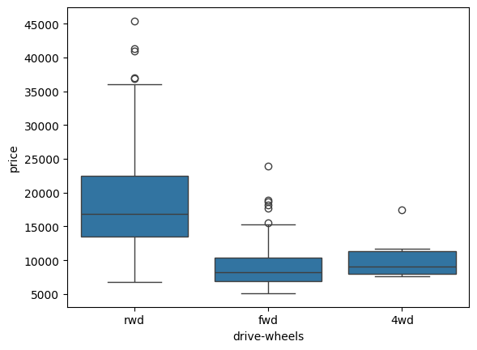

# Analyse de Données - Automobile Dataset

## Description du Projet
Ce projet consiste en une analyse exploratoire et une visualisation des données du dataset automobile. L'objectif est d'identifier les relations entre les variables et de déterminer les facteurs influençant le prix des voitures.

---

## Étapes Réalisées

### 1. Chargement des Données
- Les données ont été importées depuis un fichier CSV en ligne.
- Les données ont été sauvegardées localement dans un fichier nommé `usedcars.csv`.

### 2. Exploration des Données
- Affichage des premières lignes du DataFrame pour comprendre la structure des données.
- Vérification des types de données pour chaque colonne.

### 3. Analyse de Corrélation
- Calcul des coefficients de corrélation entre les variables numériques.
- Visualisation des relations entre les variables à l'aide de graphiques de régression.

#### Exemple : Relation entre `engine-size` et `price`

#### Exemple : Relation entre `highway-mpg` et `price`

### 4. Analyse Catégorielle
- Utilisation de boxplots pour explorer la relation entre les variables catégorielles et le prix.

#### Exemple : Relation entre `body-style` et `price`

#### Exemple : Relation entre `drive-wheels` et `price`

### 5. Groupement et Agrégation
- Groupement des données par `drive-wheels` et `body-style` pour calculer les moyennes des prix.
- Création de tableaux croisés dynamiques pour visualiser les résultats.

#### Exemple : Tableau croisé dynamique

### 6. Analyse Statistique
- Calcul des coefficients de corrélation de Pearson pour évaluer la force et la direction des relations entre les variables.
- Identification des variables les plus importantes pour prédire le prix des voitures.

---

## Résultats
- Les variables suivantes ont été identifiées comme les plus importantes pour prédire le prix :
  - **Variables numériques continues** : `length`, `width`, `curb-weight`, `engine-size`, `horsepower`, `city-mpg`, `highway-mpg`, `wheel-base`, `bore`.
  - **Variables catégorielles** : `drive-wheels`.

---

## Technologies Utilisées
- **Python** : Langage principal.
- **Pandas** : Manipulation et nettoyage des données.
- **NumPy** : Calculs numériques.
- **Matplotlib** et **Seaborn** : Visualisation des données.
- **Scipy** : Analyse statistique.

---