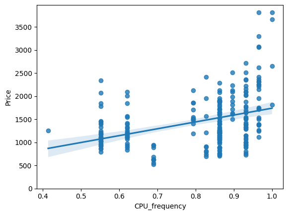
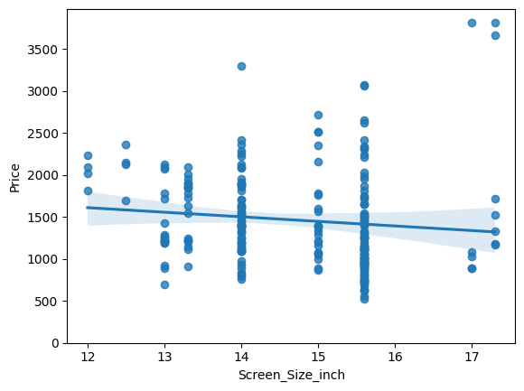
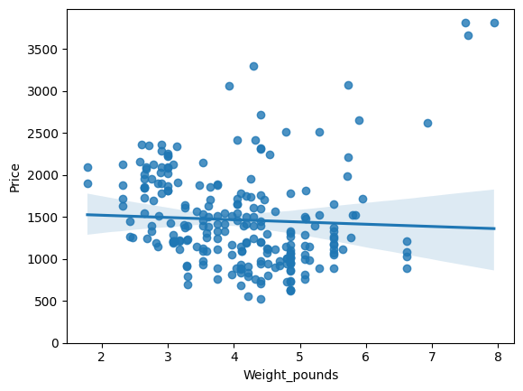
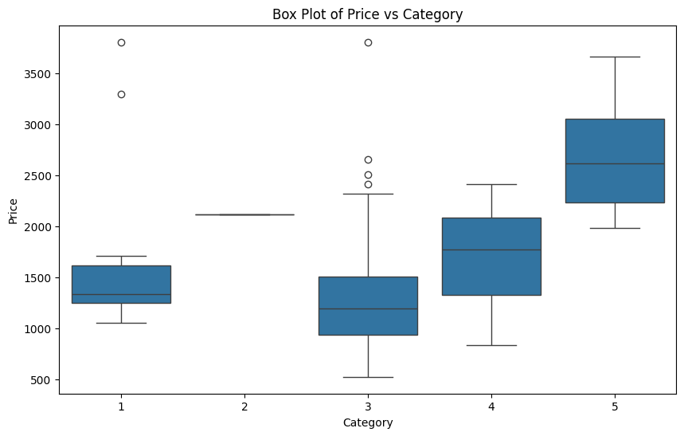
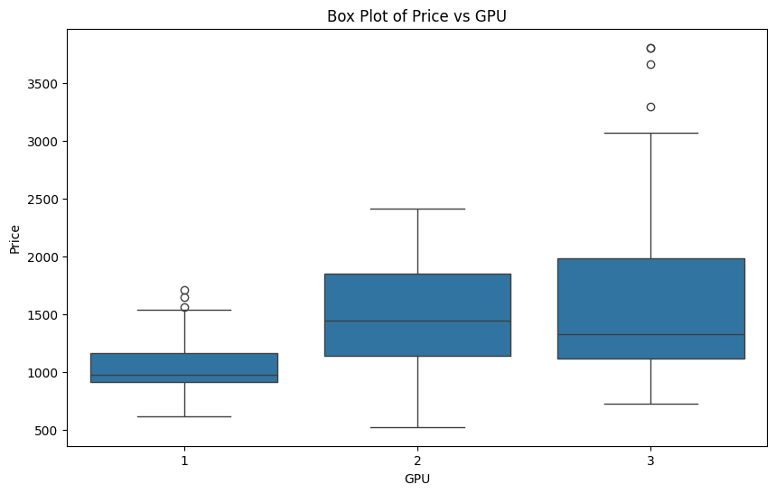
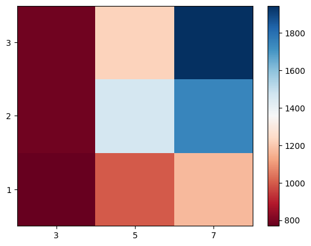

# Analyse des Prix des Ordinateurs Portables

## Introduction
Ce projet vise à analyser les facteurs influençant les prix des ordinateurs portables en utilisant un ensemble de données contenant des informations sur diverses caractéristiques des ordinateurs portables. Nous avons utilisé des bibliothèques Python telles que `pandas`, `numpy`, `matplotlib`, `seaborn`, et `scipy` pour effectuer l'analyse.

---

## Étapes du Projet

### 1. Chargement des Données
Les données ont été récupérées depuis un fichier CSV disponible à l'URL suivante :
```
https://cf-courses-data.s3.us.cloud-object-storage.appdomain.cloud/IBMDeveloperSkillsNetwork-DA0101EN-Coursera/laptop_pricing_dataset_mod2.csv
```
Elles ont ensuite été sauvegardées localement sous le nom `laptop.csv`.

### 2. Exploration des Données
Nous avons exploré les données en affichant les premières lignes et en générant des statistiques descriptives :
- **Variables continues** : `CPU_frequency`, `Screen_Size_inch`, `Weight_pounds`, etc.
- **Variables catégoriques** : `Category`, `GPU`, `OS`, etc.

### 3. Visualisation des Relations
#### Régressions Linéaires
Nous avons utilisé des graphiques de régression pour visualiser les relations entre certaines variables continues et le prix.

- **CPU Frequency vs Price**  
    

- **Screen Size vs Price**  
    

- **Weight vs Price**  
    

#### Boxplots
Des boxplots ont été générés pour analyser les relations entre les variables catégoriques et le prix.

- **Category vs Price**  
    

- **GPU vs Price**  
    

- **OS vs Price**  
    

### 4. Corrélations
Nous avons calculé les coefficients de corrélation de Pearson pour évaluer la force des relations entre les variables continues et le prix. Par exemple :
- **CPU_frequency** : Coefficient = 0.286, P-value = 7.22e-06
- **Weight_pounds** : Coefficient = -0.050, P-value = 0.78

### 5. Tableaux Croisés
Nous avons créé des tableaux croisés pour analyser les moyennes des prix en fonction des combinaisons de `GPU` et `CPU_core`.

| GPU | CPU_core = 3 | CPU_core = 5 | CPU_core = 7 |
|-----|--------------|--------------|--------------|
| 1   | 769.25       | 998.50       | 1167.94      |
| 2   | 785.08       | 1462.20      | 1744.62      |
| 3   | 784.00       | 1220.68      | 1945.10      |

Une visualisation a été générée pour mieux comprendre ces relations :


---

## Résultats Clés
1. **Variables Continues** :
     - `CPU_frequency` a une corrélation modérée et positive avec le prix.
     - `Weight_pounds` a une corrélation très faible et négative avec le prix.

2. **Variables Catégoriques** :
     - Les catégories comme `GPU`, `Category`, et `OS` influencent fortement le prix.

3. **Tableaux Croisés** :
     - Les combinaisons de `GPU` et `CPU_core` montrent des variations significatives dans les prix moyens.

---

## Conclusion
Cette analyse a permis d'identifier les caractéristiques les plus importantes influençant le prix des ordinateurs portables. Ces informations peuvent être utilisées pour prédire les prix ou pour guider les décisions d'achat et de conception.

---

## Fichiers et Ressources
- **Données** : `laptop.csv`
- **Code Source** : Disponible dans le fichier Jupyter Notebook.

