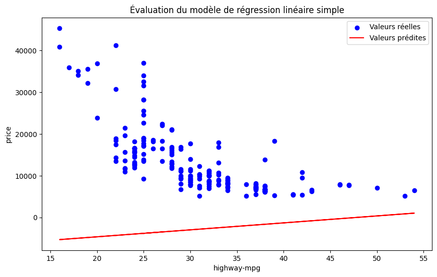
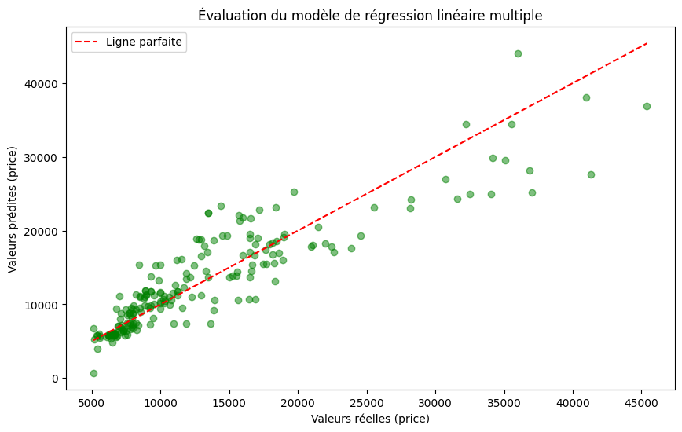
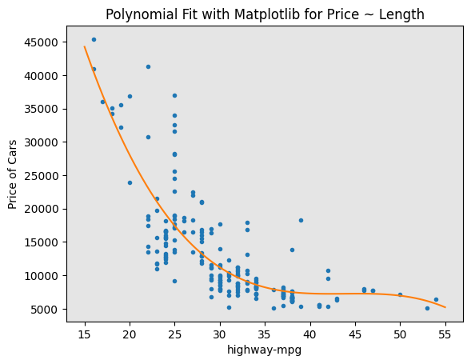
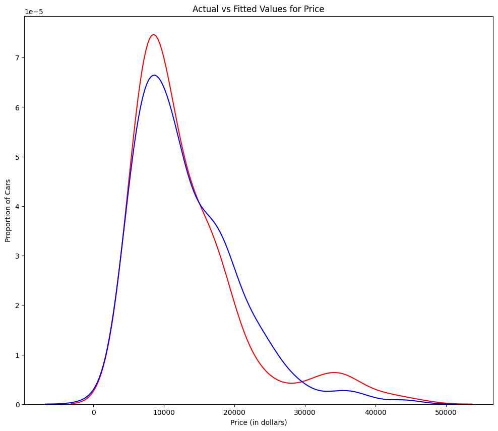

## Résumé du Projet : Analyse et Modélisation des Données Automobiles

### Objectif
L'objectif principal de ce projet était d'analyser les données automobiles pour comprendre les relations entre différentes caractéristiques des voitures et leur prix. Nous avons utilisé des techniques de régression linéaire simple, régression linéaire multiple, régression polynomiale et pipelines pour modéliser ces relations et effectuer des prédictions.

---

### Étapes Réalisées

#### 1. Chargement et Préparation des Données
- Les données ont été chargées depuis un fichier CSV.
- Les colonnes pertinentes ont été sélectionnées pour l'analyse, notamment `highway-mpg`, `engine-size`, `horsepower`, `curb-weight`, et `price`.

#### 2. Régression Linéaire Simple
- Une régression linéaire simple a été réalisée pour analyser la relation entre `highway-mpg` et `price`.
- **Résultats :**
    - Pente (`slope`) : 166.86
    - Ordonnée à l'origine (`intercept`) : -7963.34
    - R-carré : 0.4966
    - MSE : 3.16 x 10⁷
- **Illustration :**

    

#### 3. Régression Linéaire Multiple
- Une régression linéaire multiple a été réalisée en utilisant plusieurs variables indépendantes (`horsepower`, `curb-weight`, `engine-size`, `highway-mpg`) pour prédire `price`.
- **Résultats :**
    - R-carré : 0.8089
    - MSE : 1.2 x 10⁷
- **Illustration :**
    
    

#### 4. Régression Polynomiale
- Une régression polynomiale a été réalisée pour capturer les relations non linéaires entre `highway-mpg` et `price`.
- **Modèles :**
    - Polynôme de degré 3 : `poly1d([-1.5566, 204.7543, -8965.4331, 137923.594])`
    - Polynôme de degré 11 : `poly1d([-1.2426e-08, 4.7218e-06, ..., 3.8793e+08])`
- **Illustration :**
    

#### 5. Pipelines
- Un pipeline a été créé pour standardiser les données, appliquer une transformation polynomiale et ajuster un modèle de régression linéaire.
- **Pipeline :**
    ```python
    Input = [('scale', StandardScaler()), ('polynomial', PolynomialFeatures(include_bias=False)), ('model', LinearRegression())]
    pipe = Pipeline(Input)
    pipe.fit(Z, y)
    ypipe = pipe.predict(Z)
    ```

#### 6. Évaluation des Modèles
- Les modèles ont été évalués en utilisant des métriques comme le R-carré et le MSE.
- Comparaison des modèles :
    - **Régression Linéaire Simple :**
        - R-carré : 0.4966
        - MSE : 3.16 x 10⁷
    - **Régression Linéaire Multiple :**
        - R-carré : 0.8089
        - MSE : 1.2 x 10⁷
    - **Régression Polynomiale :**
        - R-carré : 0.6742
        - MSE : 2.05 x 10⁷

#### 7. Visualisation des Résultats
- Les valeurs réelles et prédites ont été comparées à l'aide de graphiques pour évaluer la performance des modèles.
- **Illustration :**

    

---

### Analyse des valeurs pour les différents modèles :

#### Régression Linéaire Simple : Utilisation de `highway-mpg` comme variable prédictive de `price`.
- **R-carré** : 0.49659118843391759  
- **MSE** : 3.16 x 10^7  

#### Régression Linéaire Multiple : Utilisation de `horsepower`, `curb-weight`, `engine-size` et `highway-mpg` comme variables prédictives de `price`.
- **R-carré** : 0.80896354913783497  
- **MSE** : 1.2 x 10^7  

#### Ajustement Polynomial : Utilisation de `highway-mpg` comme variable prédictive de `price`.
- **R-carré** : 0.6741946663906514  
- **MSE** : 2.05 x 10^7  

### Comparaison des modèles :
- **MSE** : L'ajustement polynomial a réduit la MSE par rapport à la régression linéaire simple, ce qui indique un meilleur ajustement.  
- **R-carré** : L'ajustement polynomial a également augmenté le R-carré par rapport à la régression linéaire simple, ce qui montre une meilleure explication de la variance des données.  
Ainsi, l'ajustement polynomial est un meilleur modèle que la régression linéaire simple pour prédire `price` en fonction de `highway-mpg`.

### Régression Linéaire Multiple (MLR) vs Ajustement Polynomial :
- **MSE** : La MSE pour la MLR est plus petite que celle de l'ajustement polynomial.  
- **R-carré** : Le R-carré pour la MLR est également beaucoup plus élevé que celui de l'ajustement polynomial.  

### Conclusion :
En comparant ces trois modèles, nous concluons que le modèle MLR est le meilleur pour prédire `price` à partir de notre ensemble de données. Ce résultat est logique, car nous avons 27 variables au total, et nous savons que plusieurs d'entre elles sont des prédicteurs potentiels du prix final des voitures.

Ce projet a permis de mieux comprendre les relations entre les caractéristiques des voitures et leur prix, tout en explorant différentes techniques de modélisation.