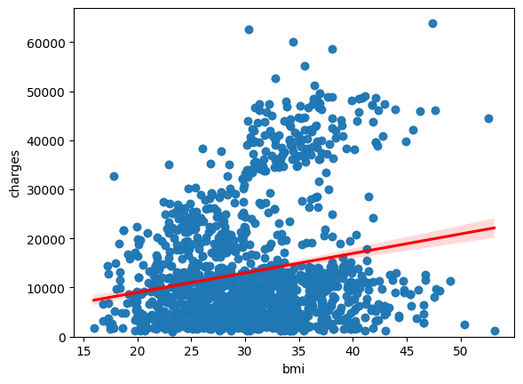
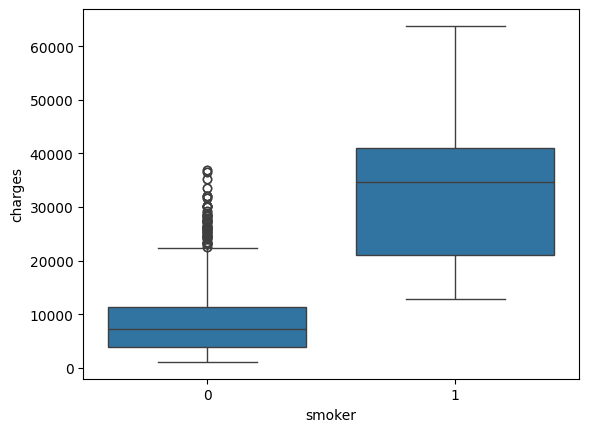
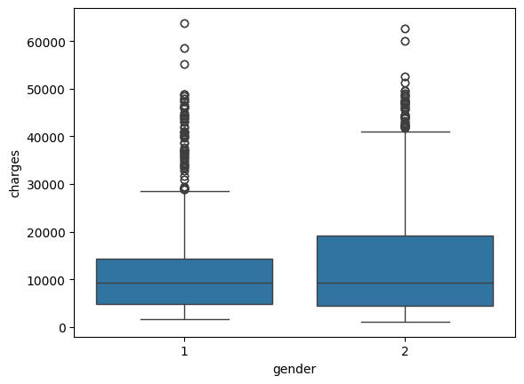
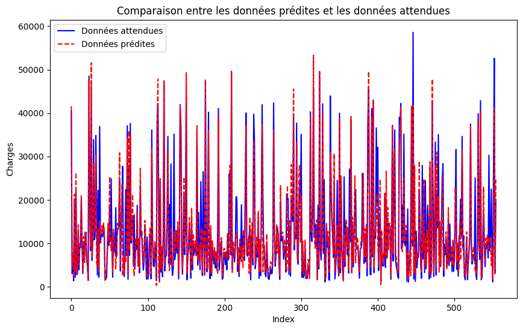
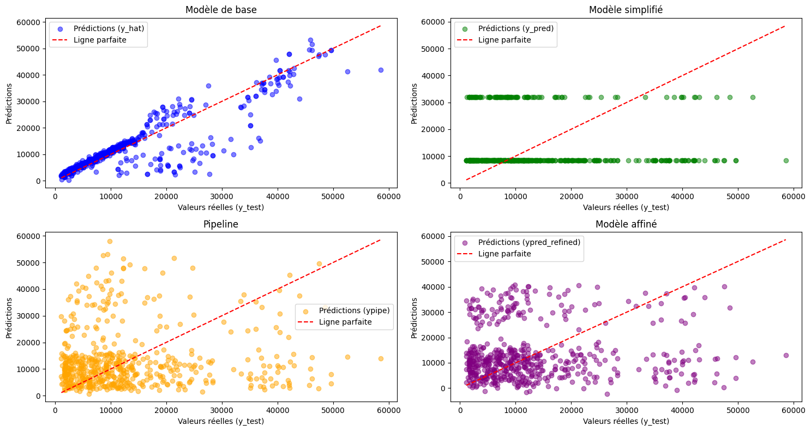

# Résumé du Projet

## Introduction
Ce projet vise à analyser un ensemble de données médicales pour comprendre les relations entre différentes variables et les frais médicaux. Nous avons également développé des modèles prédictifs pour estimer les frais médicaux en fonction des caractéristiques des patients.

---

## Étapes du Projet

### 1. Importation des Données
- Les données ont été importées depuis une source en ligne et enregistrées localement pour une utilisation ultérieure.

### 2. Préparation des Données
- Nettoyage des données : remplacement des valeurs manquantes par des moyennes ou des modes.
- Conversion des types de données pour assurer la cohérence et faciliter l'analyse.

### 3. Analyse Exploratoire des Données (EDA)
- Visualisation des relations entre les variables (ex. : `bmi` et `charges`, `smoker` et `charges`).
- Calcul des corrélations pour identifier les variables les plus influentes.

### 4. Développement de Modèles
- Régression linéaire simple et multiple pour prédire les frais médicaux.
- Utilisation de pipelines pour normaliser les données et ajouter des termes polynomiaux.
- Évaluation des modèles avec des métriques comme le coefficient de détermination (R²).

### 5. Affinage des Modèles
- Division des données en ensembles d'entraînement et de test.
- Application de la régression Ridge pour réduire le surapprentissage.
- Utilisation de termes polynomiaux pour améliorer la précision des prédictions.

---

## Résultats
- Les modèles développés ont permis de prédire les frais médicaux avec une précision raisonnable.
- Les variables comme `smoker` et `bmi` ont montré une forte corrélation avec les frais médicaux.

---

## Illustrations
### Visualisation des Relations entre les Variables

### Comparaison des Prédictions et des Valeurs Réelles

### Évaluation des Modèles

---

## Conclusion
Ce projet a permis de mieux comprendre les facteurs influençant les frais médicaux et de développer des modèles prédictifs efficaces. Les résultats obtenus peuvent être utilisés pour des analyses futures ou pour informer les politiques de santé.