# Projet d'Analyse et de Modélisation des Prix des Maisons

Ce projet vise à analyser un ensemble de données sur les maisons, à effectuer un prétraitement des données, à explorer les relations entre les variables, et à construire des modèles de régression pour prédire les prix des maisons. Voici un résumé détaillé de toutes les étapes réalisées dans ce projet.

---

## 1. Chargement des Bibliothèques et Configuration
Nous avons importé les bibliothèques nécessaires pour l'analyse des données, la visualisation et la modélisation :
```python
import pandas as pd
import matplotlib.pyplot as plt
import numpy as np
import seaborn as sns
from sklearn.pipeline import Pipeline
from sklearn.preprocessing import StandardScaler, PolynomialFeatures
from sklearn.linear_model import LinearRegression, Ridge
from sklearn.metrics import mean_squared_error, r2_score
from sklearn.model_selection import train_test_split
%matplotlib inline
```

---

## 2. Chargement des Données
Les données ont été chargées depuis une URL et sauvegardées localement :
```python
filepath = 'https://cf-courses-data.s3.us.cloud-object-storage.appdomain.cloud/IBMDeveloperSkillsNetwork-DA0101EN-SkillsNetwork/labs/FinalModule_Coursera/data/kc_house_data_NaN.csv'
data = pd.read_csv(filepath)
data.to_csv('kc_house_data.csv', index=False)
df = pd.read_csv('kc_house_data.csv')
```

---

## 3. Nettoyage des Données
### Suppression de Colonnes Inutiles
Nous avons supprimé la colonne `Unnamed: 0` :
```python
df = df.drop(columns=['Unnamed: 0'])
```

### Conversion des Dates
La colonne `date` a été convertie en format datetime :
```python
df['date'] = pd.to_datetime(df['date'], format='%Y%m%dT%H%M%S')
```

### Gestion des Valeurs Manquantes
Les colonnes avec des valeurs manquantes ont été identifiées et les valeurs manquantes ont été remplacées par la moyenne de chaque colonne :
```python
missing_columns = df.columns[df.isnull().any()]
for column in missing_columns:
    df[column].fillna(df[column].mean(), inplace=True)
```

---

## 4. Exploration des Données
### Aperçu des Données
Nous avons affiché les premières et dernières lignes du DataFrame ainsi que des informations générales :
```python
df.head()
df.tail(10)
df.info()
```

### Matrice de Corrélation
Une heatmap a été tracée pour visualiser les corrélations entre les variables :
```python
correlation_matrix = df.corr()
plt.figure(figsize=(12, 8))
sns.heatmap(correlation_matrix, annot=True, fmt=".2f", cmap="coolwarm", cbar=True)
plt.title("Matrice de corrélation")
plt.show()
```

### Analyse des Relations avec `price`
Des graphiques de régression ont été tracés pour chaque variable numérique par rapport à `price` :
```python
numeric_columns = df.select_dtypes(include=['float64', 'int64']).columns
for column in numeric_columns:
    if column != 'price':
        plt.figure(figsize=(8, 6))
        sns.regplot(x=column, y='price', data=df, scatter_kws={'alpha':0.3}, line_kws={'color':'red'})
        plt.title(f"Régression entre {column} et price")
        plt.xlabel(column)
        plt.ylabel('price')
        plt.show()

```
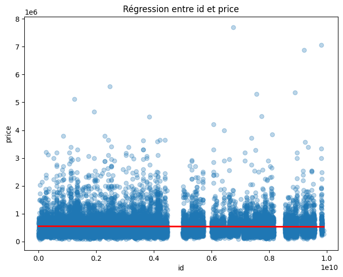 
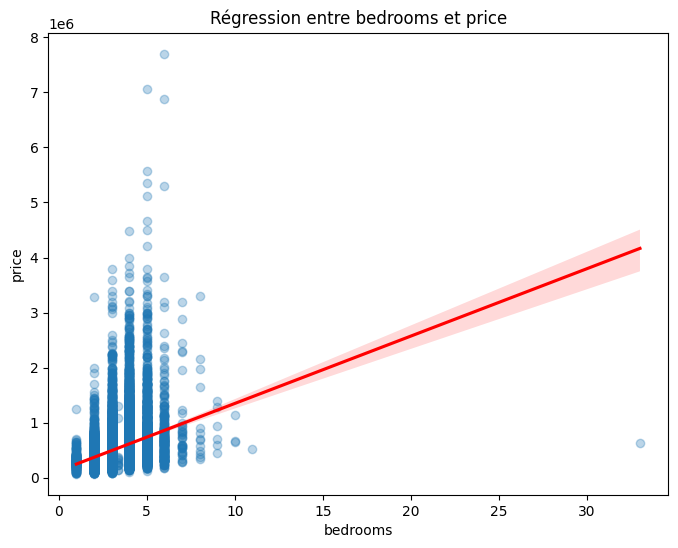
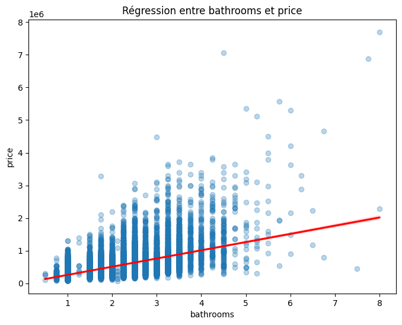
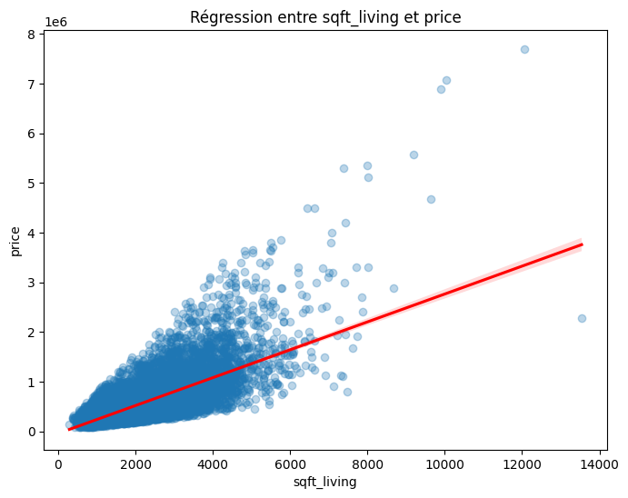
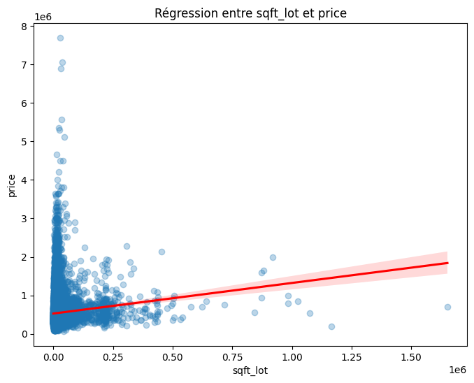
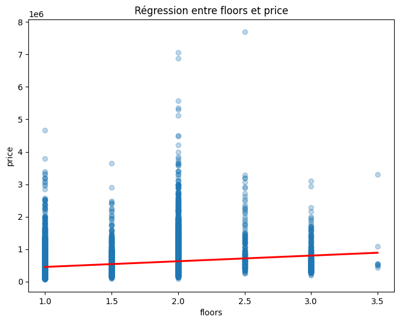
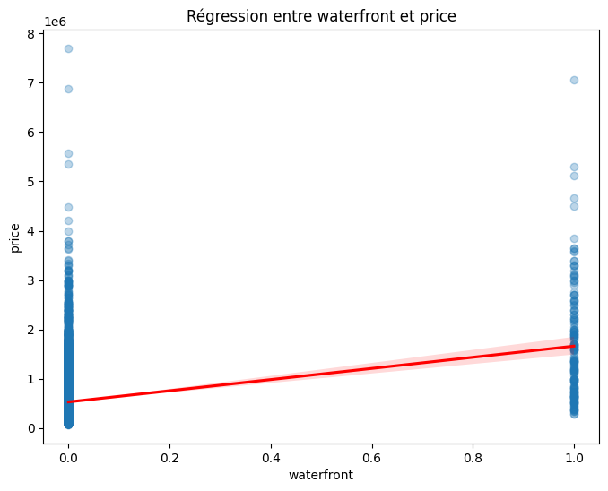
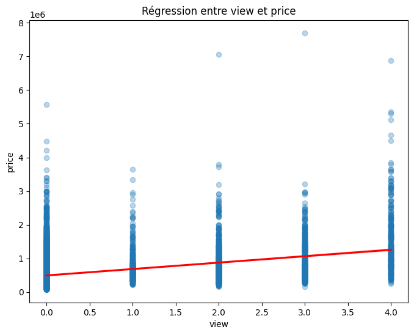
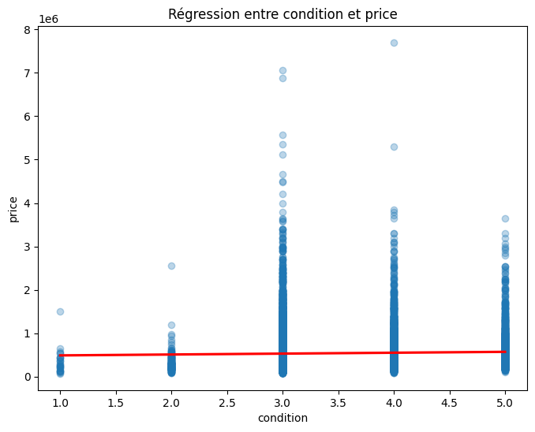
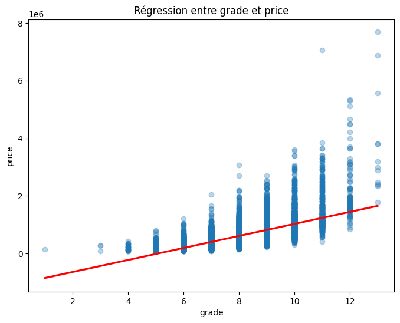
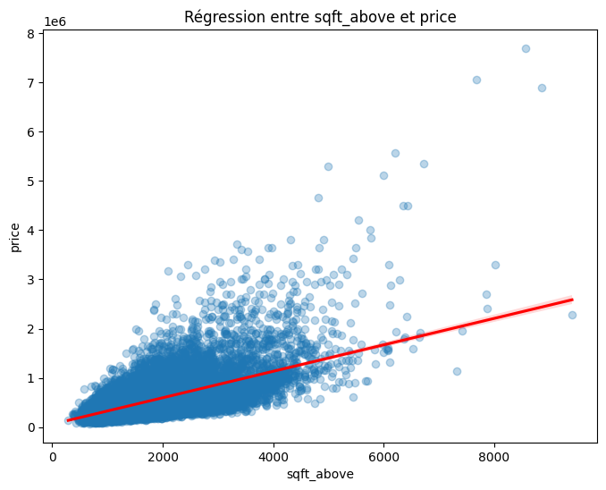
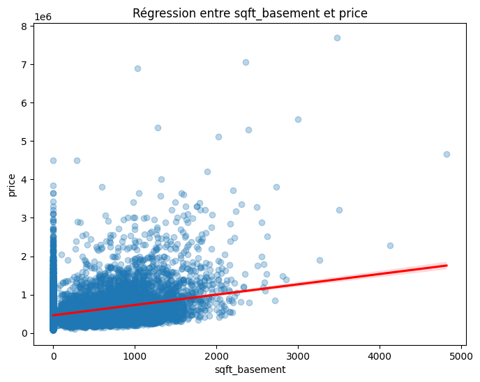
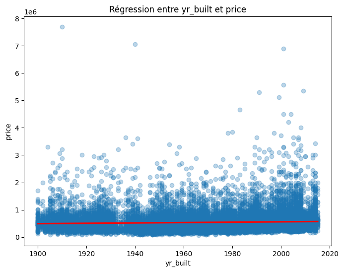
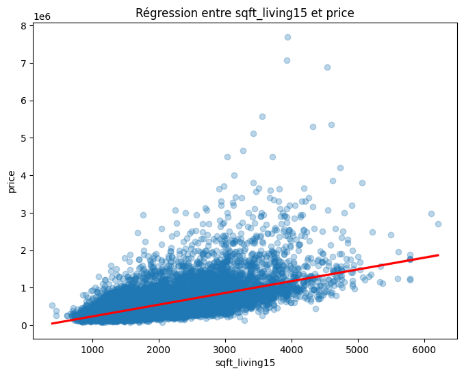
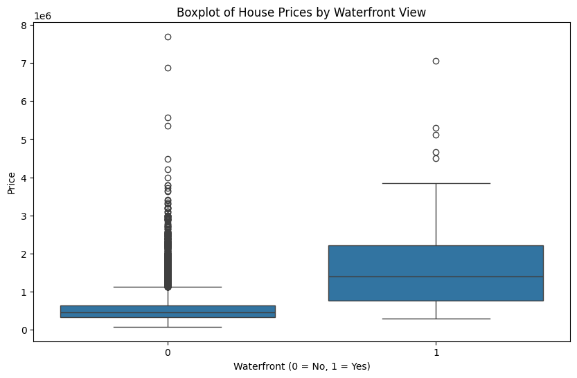

### Analyse des Prix par Vue sur l'Eau
Un boxplot a été créé pour comparer les prix des maisons avec et sans vue sur l'eau :
```python
plt.figure(figsize=(10, 6))
sns.boxplot(x='waterfront', y='price', data=df)
plt.title('Boxplot of House Prices by Waterfront View')
plt.xlabel('Waterfront (0 = No, 1 = Yes)')
plt.ylabel('Price')
plt.show()
```

---

## 5. Modélisation
### Régression Linéaire Simple
Nous avons construit un modèle de régression linéaire simple pour prédire `price` en fonction de différentes variables :
```python
X = df[['long']]
Y = df['price']
lm = LinearRegression()
lm.fit(X, Y)
lm.score(X, Y)
```

### Régression Linéaire Multiple
Un modèle de régression linéaire multiple a été construit avec plusieurs variables explicatives :
```python
features = ['bedrooms', 'bathrooms', 'sqft_living', 'sqft_lot', 'floors', 'waterfront', 'view', 
            'condition', 'grade', 'sqft_above', 'sqft_basement', 'yr_built', 'yr_renovated', 
            'zipcode', 'lat', 'long', 'sqft_living15', 'sqft_lot15']
X = df[features]
y = df['price']
model = LinearRegression()
model.fit(X, y)
model.score(X, y)
```

### Pipeline avec StandardScaler et Régression Linéaire
Un pipeline a été créé pour standardiser les données et appliquer une régression linéaire :
```python
pipeline = Pipeline([
    ('scaler', StandardScaler()),
    ('linear_regression', LinearRegression())
])
pipeline.fit(X, y)
r2_score = pipeline.score(X, y)
```

### Régression Ridge
Un modèle de régression Ridge a été construit pour réduire le surapprentissage :
```python
ridge_model = Ridge(alpha=0.1)
ridge_model.fit(x_train, y_train)
ridge_r2 = ridge_model.score(x_test, y_test)
```

### Régression Ridge avec Transformation Polynômiale
Une transformation polynomiale de degré 2 a été appliquée aux données, suivie d'une régression Ridge :
```python
poly = PolynomialFeatures(degree=2)
x_train_poly = poly.fit_transform(x_train)
x_test_poly = poly.transform(x_test)
ridge_model_poly = Ridge(alpha=0.1)
ridge_model_poly.fit(x_train_poly, y_train)
ridge_r2_poly = ridge_model_poly.score(x_test_poly, y_test)
```

---

## 6. Évaluation des Modèles
### Séparation des Données
Les données ont été divisées en ensembles d'entraînement et de test :
```python
x_train, x_test, y_train, y_test = train_test_split(X, Y, test_size=0.15, random_state=1)
```

### Calcul des Performances
Les métriques R² et MSE ont été calculées pour évaluer les modèles :
```python
from sklearn.metrics import mean_squared_error
y_pred = model.predict(X)
mse = mean_squared_error(y, y_pred)
```

---

## 7. Résultats
- **R² pour la régression linéaire multiple** : `0.701`
- **R² pour la régression Ridge** : `0.648`
- **R² pour la régression Ridge avec transformation polynomiale** : `0.700`

---

## 8. Conclusion
Ce projet a permis d'explorer les données, de comprendre les relations entre les variables, et de construire plusieurs modèles de régression pour prédire les prix des maisons. Les résultats montrent que la régression Ridge avec transformation polynomiale offre des performances comparables à la régression linéaire multiple, tout en réduisant le risque de surapprentissage.